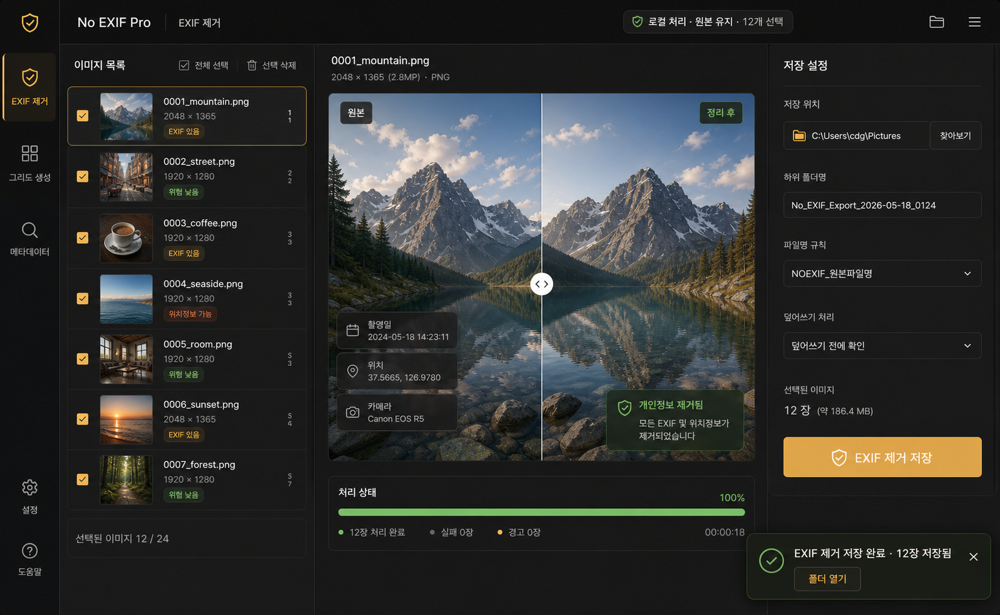
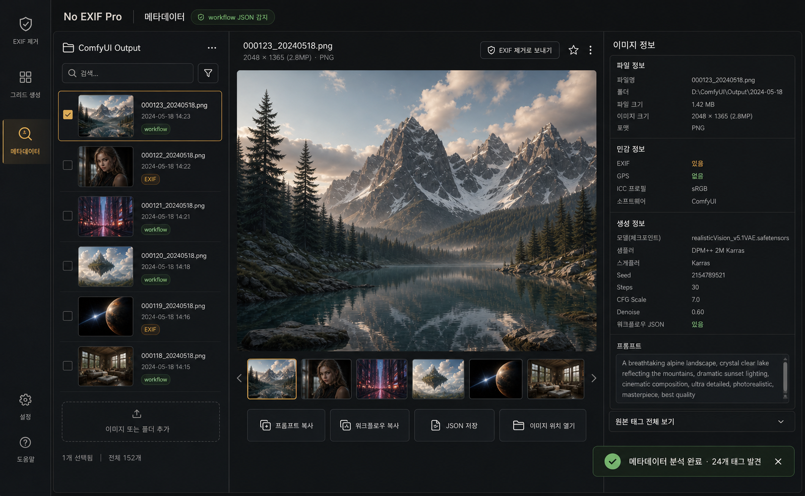

# No EXIF Pro

No EXIF Pro is a local-first desktop workbench for AI image creators who need to inspect, clean, organize, and share generated images without leaking metadata.

It is built for workflows around ComfyUI and similar image-generation tools: load a folder of generated images, inspect EXIF and PNG text metadata, remove privacy-sensitive fields, build export grids, review prompt/workflow data, create prompt-share cards, and optionally import Pixiv reference batches into the same private workspace.



## Why This Exists

Generated image folders get messy fast. A creator may have hundreds of PNGs with embedded workflow JSON, prompt text, model names, seeds, camera EXIF, or GPS fields from source images. No EXIF Pro gives that creator one local desktop surface for cleanup and review instead of bouncing between file explorers, scripts, image viewers, and metadata tools.

The guiding principle is simple: the app should feel like a private command workbench, not a cloud gallery. Files stay local, actions are explicit, and privacy state is visible without turning the tool into a warning screen.

## Features

- Local EXIF inspection and clean export while preserving the original files.
- ComfyUI prompt and workflow metadata review for PNG text chunks.
- Grid Studio for arranging image batches into shareable layouts.
- Prompt Card Studio for exporting polished prompt or recipe cards.
- Pixiv import mode for listing, filtering, downloading, and adding selected images to the workbench.
- Command palette for fast mode switching and core actions.
- Electron security hardening with renderer sandboxing, trusted origin checks, path access guards, and clean PNG validation.
- JavaScript, Python, Electron security, and Playwright-based QA coverage.

## Screenshots

| EXIF cleanup | Grid Studio | Metadata review |
| --- | --- | --- |
|  |  |  |

## Tech Stack

- Desktop shell: Electron
- Frontend: React 18, Vite, Konva, GSAP, lucide-react
- Local processing bridge: Python, Pillow, pixivpy3
- Tests: Node test runner, Python unittest, Playwright Electron QA

Electron is the desktop app shell. Think of it as the window and wiring for the tool. React is the control panel the user sees. The Python bridge is the engine room that performs image and Pixiv operations. Electron IPC is the intercom between the panel and the engine room.

## Quick Start

Requirements:

- Node.js 20 or newer
- Python 3.10 or newer
- Windows is the primary tested platform

Install and run:

```powershell
npm install
npm run start
```

The convenience launcher also installs missing app dependencies before starting the desktop app:

```powershell
.\run.bat
```

## Development

Run the focused test suites:

```powershell
npm run test:js
npm run test:py
```

Build the renderer:

```powershell
npm run build
```

Run the full local verification suite:

```powershell
npm run verify
```

`npm run verify` builds the app, runs JavaScript tests, runs Python tests, runs Electron QA, and checks high-severity npm audit findings.

## Privacy and Security

No EXIF Pro is designed around local processing. The app does not require a hosted backend for image cleanup, metadata review, grid export, or prompt-card export.

Pixiv import requires a user-provided refresh token for Pixiv API access. The token is entered by the user for the current operation and must never be committed to the repository, pasted into issues, or included in screenshots.

The repository intentionally ignores local outputs, downloads, virtual environments, environment files, auth files, and token files. See [SECURITY.md](SECURITY.md) for reporting guidance.

## Project Status

This is an early open-source release candidate. The core desktop workflow, Pixiv bridge, security checks, and test coverage are in place, but packaging, signed releases, and cross-platform QA still need work.

Useful next milestones:

- Publish a packaged Windows release.
- Add CI for build, JavaScript tests, and Python tests.
- Expand sample fixtures that are safe to keep in the repository.
- Add a first-run setup flow for Python bridge dependencies.

## License

MIT. See [LICENSE](LICENSE).
